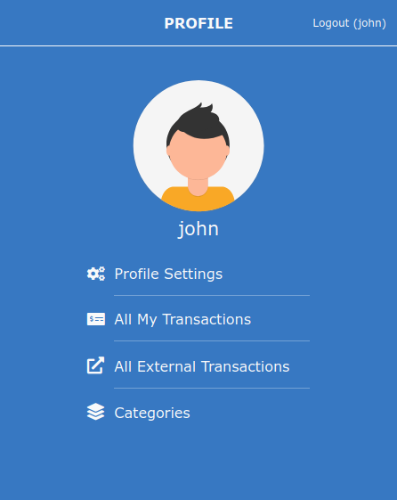
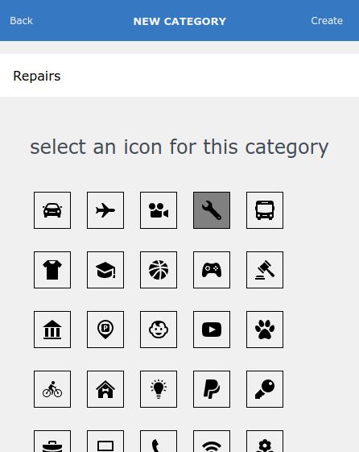
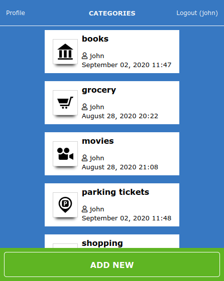

# Expense Tracker
> This is a simple web app to track expenses. You can track transactions based on expense categories(e.g utilities, groceries, maintenance) and also track transactions that you don't want to group.

>Design inspiration from [@Gregoire Vella](https://www.behance.net/gregoirevella)

## Built With
- Ruby 2.6
- Rails 5.2
- Bootstrap

## Live Demo
[Check it out!](https://sleepy-earth-55330.herokuapp.com/)

# Getting Started
## Installation
- clone the repository `git clone https://github.com/misterpaul4/expense-tracker`
- install dependencies `bundle install`

## Usage
- migrate database `rails db:migrate`
- start server `rails server`
- open browser and run `localhost:3000`

## Test
- run `rspec` in your terminal

## Authors
👤 **Chukwuebuka Paul Ajuizeogu**
- Github: [@misterpaul4](https://github.com/misterpaul4)
- Twitter: [@paulajuze](https://twitter.com/paulajuze)
- Linkedin: [Chukwuebuka Paul Ajuizeogu](https://www.linkedin.com/in/chukwuebuka-paul-ajuizeogu/)

## 🤝 Contributing
Contributions, issues and feature requests are welcome! Feel free to check the issues page.

## Show your support
Give a ⭐️ if you like this project!